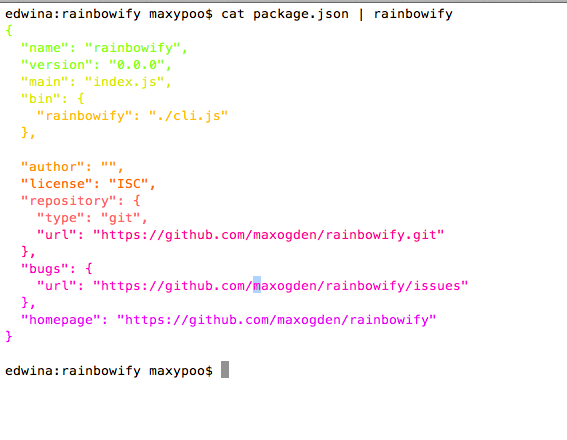

# rainbowify

[](https://nodei.co/npm/rainbowify/)

rainbow print stuff in terminal!

## usage

```
npm install rainbowify -g
cat file.txt | rainbowify
```



## credits

extracted from the [Nyan cat runner in Mocha](https://github.com/visionmedia/mocha/blob/master/lib/reporters/nyan.js)
